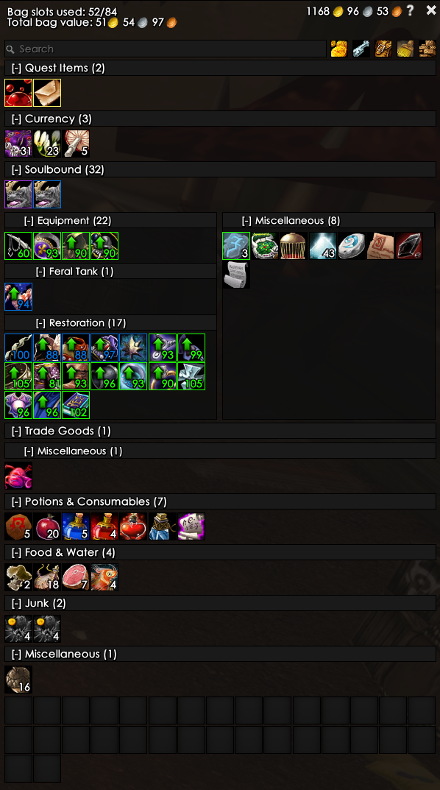
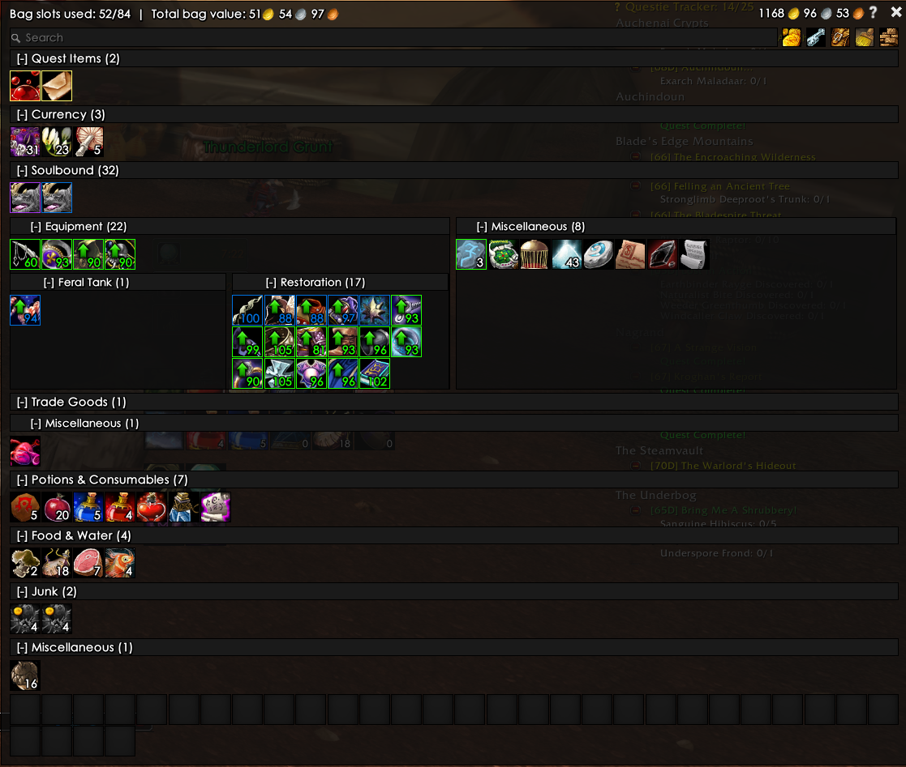
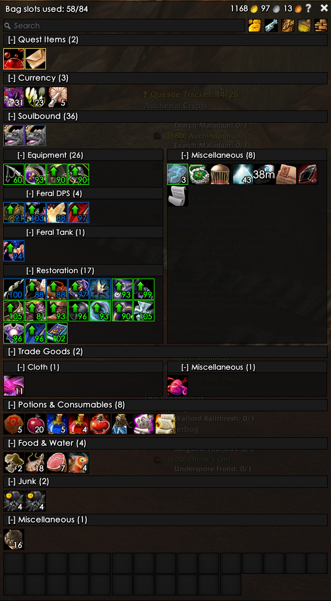

# ElvUI Bag Categories

Splits ElvUI's bag and bank windows into labeled, collapsible categories — Quest Items, Currency, Soulbound gear, Trade Goods, and a dozen more — instead of one long grid of icons, with a drag-to-reorder sort, per-category on/off switches, and an optional running gold total.

| | |
|---|---|
| **Version** | 1.0.0 |
| **Author** | ludvigaf |
| **Requires** | ElvUI |
| **Optional** | ItemRack, Auctionator |
| **Slash command** | `/bagcategories` |
| **Repository** | https://github.com/ludvigaf/ElvUI_BagCategories |

- [Overview](#overview)
- [Category model](#category-model)
- [Configuration](#configuration)
- [Profiles](#profiles)
- [ItemRack equipment sets](#itemrack-equipment-sets)
- [Bag & bank value](#bag--bank-value)
- [Slash commands](#slash-commands)

## Overview

By default, ElvUI's bag window is a single grid: every item from every bag, in whatever order the game hands them to you, cut off by a fixed number of columns. Bag Categories reads the same slot data ElvUI already has and re-lays it out as a stack of labeled sections instead — each with its own header, its own item count, and its own show/hide toggle. The same grouping applies to the bank window, controlled by a separate switch.

Every item is placed by a single classification pass per slot: item class, subclass, bind state, and (for a few categories) whether it's tied to a quest currently in your log, is marked as junk, or is a bag key versus a keyring key. Trade Goods and Recipes go one step further and split themselves live by the item's real in-game subtype text — the same string the tooltip and auction house show — so a material or profession list never drifts out of sync with the game's own data.



A grouped bag window. Soulbound gear is further split into per-set panels — `Feral Tank` and `Restoration` — picked up automatically from ItemRack.

| | |
|---|---|
|  |  |
| At extra width, sibling categories share a row — here `Equipment`/`Miscellaneous`, and `Feral Tank`/`Restoration` nested underneath. | A newly-created ItemRack set (`Feral DPS`) and a live Trade Goods subtype (`Cloth`) both appear without any manual setup. |

## Category model

Every category is a node on a tree, and every node's position in that tree is also its identity: a dot-joined path like `soulbound.mounts.flying`. That one string is simultaneously the saved-variables key for whether the category is enabled, whether it's currently collapsed, and its bucket key while items are being sorted into columns.

### Default top-level order

| # | Category | Default | What lands here |
|---|---|---|---|
| 1 | Quest Items | On | Any item — of any item class — currently tied to a quest in your log. |
| 2 | Currency | On | Quest-class items *not* tied to an active quest — reputation/faction tokens like Mark of Thrallmar — plus the separate Money item class, which is what PvP Marks of Honor (Alterac Valley, Arathi Basin, ...) use. Both are the same kind of stackable turn-in currency. |
| 3 | BoE *(parent)* | On | Unbound items whose bind type is Bind on Equip. Split by rarity — see below (off by default). |
| 4 | Soulbound *(parent)* | On | Bound gear and other bound items. Expands into three children — see below. |
| 5 | Potions & Consumables *(parent)* | On | Consumable-class items other than food/drink. Split by type — see below. |
| 6 | Food & Water | On | The Food & Drink consumable subclass specifically. |
| 7 | Reagents | On | Reagent-class items. |
| 8 | Gems *(parent)* | On | Gem-class items. Split by color — see below. |
| 9 | Trade Goods *(parent)* | On | Split live by real material subtype — see below. |
| 10 | Recipes *(parent)* | On | Split live by real profession subtype — see below. |
| 11 | Ammo & Quivers | On | Projectiles (arrows/bullets) and the quiver/ammo pouch containers that hold them. |
| 12 | Bags | On | Spare, unequipped bags sitting in your inventory. |
| 13 | Keys | On | Key-class items in your bags only — Keyring keys are left out. |
| 14 | Pets | On | Caged companion pets, regardless of bind state. |
| 15 | Toys | On | Anything registered in the Toy Box, even uncollected. |
| 16 | Trash | On | Items flagged as junk (grey-sell items). |
| — | Miscellaneous | Always on | The permanent catch-all -- everything unmatched, as well as anything whose category is folded shut all the way to the root. Not a headed section like the rest: these land in a plain, unlabeled grid alongside the empty slots at the very end, the same way an un-categorized ElvUI bag would show them. |

### Soulbound's children

Soulbound is the one top-level category with permanent sub-structure:

- **Equipment** — bound gear and relics. This is also where ItemRack equipment-set subcategories attach — see [ItemRack equipment sets](#itemrack-equipment-sets). Also has an **Armor / Weapons / Accessories** split by broad slot kind (Accessories = Neck, Finger, Trinket, Relic, Shirt, Tabard; Weapons = any weapon or ranged slot; everything else equippable is Armor). **Off by default**, same reasoning as Mounts below — most players don't need Equipment broken down further, so it starts collapsed into plain Equipment until you opt in. Items assigned to an ItemRack set always go to that set's panel instead, regardless of this split.
- **Mounts** — split into **Flying** and **Ground**. **Off by default**: mount bags fill up fast, and most players park them somewhere else, so this whole branch starts collapsed into plain Soulbound until you opt in.
- **Other** — the Soulbound catch-all: bound items that don't fit anywhere more specific land here instead of generic Miscellaneous, since "can't be traded" is the more useful fact about them.

### Gems, Consumables, and BoE: further splits

- **Gems** split by socket color, read live from the item's real subclass: `Red` `Blue` `Yellow` `Purple` `Green` `Orange` `Meta` `Prismatic` `Simple` `Miscellaneous`. On by default, same as Trade Goods/Recipes.
- **Potions & Consumables** split by type, read live from the item's real subclass: `Potions` `Elixirs` `Flasks` `Item Enhancements` `Miscellaneous`. Item Enhancements covers anything that applies a temporary buff to an item you're using — weapon oils/stones, fishing lures (e.g. Shiny Bauble). Scrolls and bandages aren't split out yet and stay in Miscellaneous. On by default, though Item Enhancements is best-effort (spot-checked against two items, not exhaustively verified) — let me know if something unexpected lands there instead of Miscellaneous.
- **BoE** split by rarity: `Uncommon` `Rare` `Epic` `Miscellaneous`. **Off by default** — most players don't need their BoEs broken down by color, so this starts collapsed into plain BoE until you opt in.

### Trade Goods & Recipes: live subtypes

These two read the item's actual subtype text at classification time — the same string the tooltip shows — rather than a hardcoded ID table, so they can't drift out of sync with the game:

**Trade Goods** splits by material (materials are shared across professions — Ore feeds Mining, Blacksmithing, Engineering, and Jewelcrafting alike):

`Cloth` `Leather` `Metal & Stone` `Herb` `Cooking` `Elemental` `Enchanting` `Jewelcrafting` `Parts` `Devices` `Explosives` `Materials` `First Aid` `Miscellaneous`

**Recipes** splits cleanly by profession, since each recipe subtype text *is* a profession name:

`Alchemy` `Blacksmithing` `Cooking` `Enchanting` `Engineering` `First Aid` `Leatherworking` `Tailoring` `Fishing` `Jewelcrafting` `Poisons` `Miscellaneous`

Anything reported under a subtype that isn't in these lists still gets grouped — under that parent's own Miscellaneous child — instead of being lost. That leaves only genuinely subtype-less "Other" Trade Goods (raw crafting materials the game itself doesn't file under a real category) uncovered.

**First Aid** under Trade Goods is different from the rest: it's not a real subtype (the game reports these items as "Other"), it's a small hand-curated list of specific items — the Small/Large/Huge Venom Sacs — that are earmarked by what they're a crafting reagent for (Anti-Venom, Strong Anti-Venom, Powerful Anti-Venom) rather than by their own subtype text. New items are added to this list one at a time as they come up.

### Unchecking a category never hides items

Turning a category off just collapses it into the nearest enabled ancestor. Unchecking a subcategory folds its items up one level; unchecking an entire top-level category (or an entire chain, all the way up) folds all the way down to Miscellaneous:

```
Flying (off) ← Mounts (off) ← Soulbound (on) → items land in Soulbound
Flying (off) ← Mounts (off) ← Soulbound (off) → items land in Miscellaneous
```

Example: with Flying and Mounts both unchecked but Soulbound itself checked, a flying mount lands in the plain Soulbound bucket. If Soulbound were unchecked too, it would fall all the way to Miscellaneous instead -- shown ungrouped, with no header, alongside the empty slots.

## Configuration

Configuration lives inside ElvUI's own settings tree, under a **Bag Categories** entry in the left-hand list — no separate config addon required. The same panel also opens as a small standalone window via `/bagcategories config`, for tweaking things without ElvUI's full settings frame open.


The options panel, docked inside ElvUI's own settings tree.

### Top-level options

| Option | Default | Does |
|---|---|---|
| **Enable** | on | Groups items into categories in the bag window. Can also be flipped quickly with the bare `/bagcategories` command. |
| **Enable for Bank** | on | The same grouping, applied to the bank window. Kept as its own switch since bag and bank are opened independently — and can both be open at once. |
| **Show Bag/Bank Space Count** | on | A used/total slot count (e.g. `74/89`) in the top-left corner of the window. The Keyring is excluded from the count. |
| **Use ItemRack Categories** | on | If ItemRack is installed, adds one Soulbound → Equipment subcategory per saved ItemRack set — see [ItemRack equipment sets](#itemrack-equipment-sets). |
| **Show Bag/Bank Value** | on | Totals the value of everything in view, next to the slot count — see [Bag & bank value](#bag--bank-value). |

### Categories & sort order

Below the top-level options sits a **Reorder** tab plus one tab per category that has its own subcategories (Soulbound, Trade Goods, Recipes). Three things happen here:

- **Enable/disable** — every category is a checkbox; unchecking one applies the fallback rule described above. Plain categories (Quest Items, Currency, BoE, Ammo & Quivers, and the rest) live under the **Reorder** tab, below the drag list.
- **Reorder** — drag one category onto another to swap their positions. This works at every level: the root **Reorder** tab, and again inside each category's own tab (Soulbound, Trade Goods, Recipes each have a **Reorder** tab of their own — Soulbound's Mounts subcategory even nests one more level down). Order is shared between bag and bank.
- **Drill into sub-tabs** — Soulbound, Trade Goods, and Recipes each get their own tab (with an Enable toggle at the top and their own **Reorder** tab inside it) rather than showing every subcategory flattened into one long list.

Collapsing a section for the current session is done in the bag/bank window itself, not in the options panel: click the `[-]` in any category header to fold it shut (it becomes `[+]`); click again to reopen it. This state is remembered per category.

### Profiles

Every setting above — toggles, sort order, collapsed state — lives in a profile, and each character gets its own automatically; nothing needs to be set up for that. A **Profiles** section at the bottom of the options panel (standard AceDB profile management, the same kind ElvUI's own settings use) lets you copy one character's setup to another, put several characters on one shared profile, or reset a profile back to defaults.

## ItemRack equipment sets

If ItemRack is installed, every saved ItemRack set becomes its own subcategory under Soulbound → Equipment — a "Feral Tank" set built in ItemRack shows up as a matching **Feral Tank** panel in the bag, grouping exactly that gear together, wherever it's currently sorted under Soulbound.

- Read-only: this addon only reads ItemRack's saved sets, never writes to them.
- Internal ItemRack sets (prefixed `~`, like its own "Unequip" set) are skipped.
- Matching is by the item's base ID, ignoring enchant/gem/suffix variations, so an enchanted or socketed copy of a set piece still lands in its set.
- A gear piece assigned to a set is filed under its set regardless of actual bind state — it's realistically soulbound either way.
- Refreshed on every layout pass, so a set added, renamed, or edited in ItemRack mid-session appears immediately, no reload needed.
- Default order is largest set first (most items equipped), alphabetical among ties — just the starting point, since dragging sets into a custom order from the options panel overrides it from then on.

Turn this off with **Use ItemRack Categories** in the options panel if you'd rather keep all equipment in one flat Equipment section.

## Bag & bank value

When enabled, a running total (e.g. `51g 54s 97c`) appears next to the slot count, added up from whichever pricing addon is selected as the **Price Source**. Every source is read-only against that addon's own data — nothing is fetched, scanned, or written on its behalf.

| Source | Addon | Reliability |
|---|---|---|
| AtrValue *(default)* | Auctionator | Confirmed against Auctionator's public API. |
| AHDB Min Bid | AHDB | Best-effort, from long-standing community convention. |
| AHDB Min Buyout | AHDB | Best-effort, from long-standing community convention. |
| AucMarket | Auc-Advanced (Auctioneer) | Best-effort, from long-standing community convention. |
| TSM Market Value | TradeSkillMaster | Confirmed against TSM's public `TSM_API`. |

> Only a source from an addon you actually have installed produces a value. Pick a source that isn't installed and the panel shows a warning inline instead of a silently blank total.

## Slash commands

| Command | Does |
|---|---|
| `/bagcategories` | Quick-toggles grouping in the *bag* window on/off. The bank has its own separate checkbox in the options panel, so this doesn't touch it. |
| `/bagcategories config` | Opens the standalone settings window (same content as the ElvUI-docked panel, just without ElvUI's full settings frame around it). |
| `/bagcategories options` | Alias for `config`. |

<details>
<summary>For the curious: how this stays in sync with ElvUI</summary>

Bag Categories doesn't replace ElvUI's bag frame — it hooks `Bags:Layout` and `Bags:UpdateSlot` and re-lays out the same slot buttons ElvUI already created, every time ElvUI itself updates them. That re-layout runs synchronously, in the same frame, specifically so there's no visible flash back to the native ungrouped grid before the grouped one catches up.

Everything the addon needs to make a layout decision — the category tree, ItemRack's live set data, the classification rules, the saved sort order — is re-derived fresh on each pass, which is also why a brand-new ItemRack set or an unfamiliar trade-good subtype just appears correctly the next time the bag redraws, with nothing to reload.

</details>

---

ElvUI Bag Categories · v1.0.0 · by ludvigaf · [github.com/ludvigaf/ElvUI_BagCategories](https://github.com/ludvigaf/ElvUI_BagCategories)
